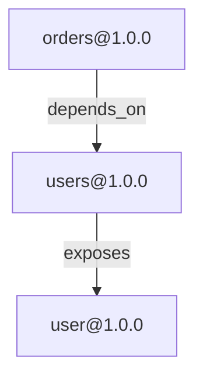

<!-- Auto-generated by GovernanceGenerator on 2025-10-01T14:12:20.628Z -->

# Protocol Governance

## System Overview

This document provides governance guidelines, architectural insights, and contribution processes for the protocol ecosystem.

### System Statistics

- **Total Protocols**: 3
- **Protocol Relationships**: 2
- **Authorities**: 1
- **Override Rules**: 20
- **Community Contributions**: 0

### Protocol Distribution

- **api**: 2 protocols
- **data**: 1 protocols


## Architecture

### Protocol Dependency Graph

The following diagram shows relationships between protocols in the ecosystem:




### Dependency Analysis

- **Total Dependencies**: 2
- **Circular Dependencies**: 0 ✓


## Data Privacy & PII Management

### PII Flow Analysis

The system tracks Personally Identifiable Information (PII) through protocol relationships:

_No PII flow detected yet._

### PII Statistics

- **PII-Containing Protocols**: 0
- **PII-Exposing Endpoints**: 0
- **PII Fields Tracked**: 0

### PII Exposure Analysis

_No PII-exposing endpoints detected._


### Privacy Guidelines

1. **PII Detection**: All new protocols must be analyzed for PII exposure
2. **Confidence Threshold**: PII detections above 70% confidence require review
3. **Override Rules**: Use community overrides to enhance PII detection accuracy
4. **Regular Audits**: Quarterly PII flow analysis recommended


## Change Management

### Breaking Change Policy

1. **Version Constraints**: Breaking changes require major version bump
2. **Impact Analysis**: Use `graph.impactOfChange()` before changes
3. **Migration Period**: Minimum 90 days for deprecations
4. **Communication**: Announce breaking changes via governance channel

### Breaking Change Detection

Breaking changes are automatically detected when:
- Field removals in data protocols
- Endpoint removals in API protocols
- Type changes with incompatible schemas
- Required field additions

### Impact Assessment

Before making breaking changes, run impact analysis:

```javascript
const { ProtocolGraph } = require('./core/graph');
const graph = new ProtocolGraph();

// Assess breaking change risk
const risk = graph.assessRisk('urn:proto:myorg:api:users:v1.0.0');
console.log(`Downstream impact: ${risk.affectedNodes.length} protocols`);
```

### Migration Support

- **Dual Versioning**: Run old and new versions in parallel during migration
- **Migration Guides**: Auto-generated from protocol diffs
- **Backward Compatibility**: Maintain for at least one major version


## Contribution Guidelines

### Override Rule Contributions

The community can contribute protocol discovery improvements through override rules.

#### Current Contributions

- **Total Community Rules**: 0
- **Organization Rules**: 0
- **Project Rules**: 0
- **Pending Exports**: 0

#### Submission Process

1. **Create Rule** from detection result:
   ```javascript
   const { OverrideEngine } = require('./core/overrides');
   const engine = new OverrideEngine();

   const rule = engine.createRule(detection, 'pii', {
     author: 'your-github-username',
     description: 'Clear description of the pattern'
   });
   ```

2. **Export Rule Pack**:
   ```javascript
   engine.exportPack('my-protocol-pack', './overrides', {
     version: '1.0.0',
     description: 'Protocol-specific patterns',
     tags: ['protocol-name', 'pii']
   });
   ```

3. **Submit PR** with:
   - Rule pack in `app/overrides/community/`
   - Test cases demonstrating matches
   - Documentation of patterns covered

#### Rule Quality Standards

- **Confidence**: Minimum 0.85 for PII patterns, 0.90 for API patterns
- **Testing**: Include 3+ positive and 2+ negative test cases
- **Documentation**: Clear description and protocol context
- **Verification**: Prefer rules verified by 10+ users

#### Review Process

1. **Automated Checks**: Schema validation, test execution
2. **Community Review**: 2+ approvals from maintainers
3. **Quality Gate**: 90%+ test coverage, no false positives
4. **Merge**: Included in next community pack release


## Quality Metrics

### System Health

- **Graph Performance**: N/A% cache hit rate
- **Override Coverage**: 20 rules loaded
- **Rule Freshness**: 260 days average age

### Override Rule Statistics

| Metric | Value |
|--------|-------|
| Total Rules | 20 |
| PII Patterns | 0 |
| API Patterns | 0 |
| Classification Rules | 0 |
| Cache Hits | 0 |
| Cache Size | 0 |

### Testing Coverage

- **Unit Tests**: All core modules require 90%+ coverage
- **Integration Tests**: Protocol graph and override integration
- **Performance Tests**: <15ms graph operations, <5ms rule matching

### Validation Rules

Active validation rules:
1. **Required Fields**: Ensure manifest completeness
2. **PII Exposure**: Detect unintentional PII in APIs
3. **Breaking Changes**: Flag incompatible modifications
4. **Deprecation Policy**: Enforce sunset timelines


---

## Additional Resources

- [Override System Documentation](../docs/overrides.md)
- [Protocol Graph API](../docs/protocol-graph.md)
- [Testing Guidelines](../docs/testing.md)

## Governance Updates

This document is auto-generated from the live system state. To update:

```bash
# Regenerate governance documentation
node -e "
const { GovernanceGenerator } = require('./app/core/governance');
const gen = new GovernanceGenerator();
gen.generateToFile('./GOVERNANCE.md').then(() => console.log('Updated'));
"
```

---

*Last updated: 2025-10-01*
