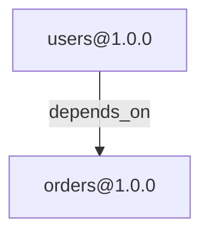
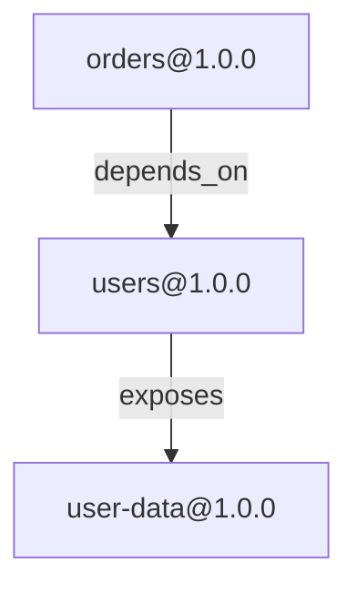
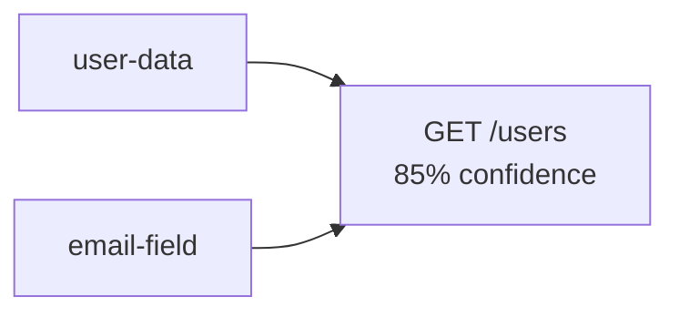

# Governance Generator Documentation

## Overview

The Governance Generator automates creation of GOVERNANCE.md documentation from live system state. It integrates with ProtocolGraph, Override Engine, and validator systems to produce comprehensive governance documentation with Mermaid visualizations.

## Features

- **Automated Generation**: Creates GOVERNANCE.md from protocol graph and override statistics
- **Mermaid Diagrams**: Visual dependency graphs and PII flow diagrams
- **Multi-Section Output**: Configurable sections for different governance concerns
- **Real-Time Metrics**: Live statistics from system components
- **Incremental Updates**: Preserve custom sections when regenerating
- **Export Options**: Generate to file or return as string

## Architecture

```
app/
├── core/
│   └── governance/
│       ├── index.js          # Main exports
│       ├── generator.js      # GovernanceGenerator + SectionGenerators
│       └── README.md         # Module documentation
├── tests/
│   └── governance/
│       └── generator.test.js # 38 comprehensive tests
└── examples/
    └── generate-governance.js # Usage example
```

## Installation

```javascript
const { GovernanceGenerator } = require('./core/governance');
const { ProtocolGraph } = require('./core/graph');
const { OverrideEngine } = require('./core/overrides');
```

## Quick Start

### Basic Usage

```javascript
const { GovernanceGenerator } = require('./core/governance');
const { ProtocolGraph } = require('./core/graph');
const { OverrideEngine } = require('./core/overrides');

// Initialize components
const graph = new ProtocolGraph();
const overrideEngine = new OverrideEngine();

// Load your protocols into graph...
// graph.addNode(...), graph.addEdge(...)

// Create generator
const generator = new GovernanceGenerator({
  graph,
  overrideEngine,
  manifests: []
});

// Generate GOVERNANCE.md
const markdown = await generator.generate({
  sections: ['all'],
  includeDiagrams: true,
  includePIIFlow: true,
  includeMetrics: true
});

console.log(markdown);
```

### Generate to File

```javascript
// Write directly to file
const result = await generator.generateToFile('./GOVERNANCE.md', {
  sections: ['all'],
  includeDiagrams: true
});

console.log(`Generated ${result.size} bytes at ${result.path}`);
```

### Update Existing File

```javascript
// Update existing GOVERNANCE.md, preserving custom sections
const result = await generator.update('./GOVERNANCE.md', {
  sections: ['overview', 'architecture', 'privacy']
});

console.log(`Updated with ${result.customSections} custom sections preserved`);
```

## API Reference

### GovernanceGenerator

Main generator class that orchestrates documentation creation.

#### Constructor

```javascript
new GovernanceGenerator(options)
```

**Options:**
- `graph` (ProtocolGraph): Protocol graph instance
- `overrideEngine` (OverrideEngine): Override engine instance
- `manifests` (Array): Protocol manifest files (optional)

**Example:**
```javascript
const generator = new GovernanceGenerator({
  graph: myGraph,
  overrideEngine: myEngine,
  manifests: []
});
```

#### generate(options)

Generate complete GOVERNANCE.md markdown.

```javascript
async generate(options): Promise<string>
```

**Options:**
- `sections` (Array<string>): Sections to include (default: `['all']`)
  - `'overview'` - System statistics and protocol distribution
  - `'architecture'` - Dependency graph with Mermaid diagram
  - `'privacy'` - PII flow analysis and privacy guidelines
  - `'changes'` - Breaking change policy and migration support
  - `'contributions'` - Override rule contribution process
  - `'metrics'` - Quality metrics and system health
  - `'all'` - Include all sections
- `includeDiagrams` (boolean): Include Mermaid diagrams (default: `true`)
- `includePIIFlow` (boolean): Include PII flow analysis (default: `true`)
- `includeMetrics` (boolean): Include quality metrics (default: `true`)

**Returns:** Promise<string> - Generated markdown content

**Example:**
```javascript
const content = await generator.generate({
  sections: ['overview', 'architecture'],
  includeDiagrams: true
});
```

#### generateToFile(outputPath, options)

Generate and write to file.

```javascript
async generateToFile(outputPath, options): Promise<Object>
```

**Parameters:**
- `outputPath` (string): Output file path
- `options` (Object): Same as `generate()` options

**Returns:** Promise<Object>
```javascript
{
  path: string,    // Output file path
  size: number     // File size in bytes
}
```

**Example:**
```javascript
const result = await generator.generateToFile('./GOVERNANCE.md');
console.log(`Written ${result.size} bytes to ${result.path}`);
```

#### update(existingPath, options)

Update existing GOVERNANCE.md, preserving custom sections.

```javascript
async update(existingPath, options): Promise<Object>
```

**Parameters:**
- `existingPath` (string): Path to existing GOVERNANCE.md
- `options` (Object): Same as `generate()` options

**Returns:** Promise<Object>
```javascript
{
  path: string,            // Output file path
  size: number,            // File size in bytes
  customSections: number   // Number of preserved custom sections
}
```

**Custom Section Markers:**
```markdown
<!-- CUSTOM_START -->
## My Custom Section
Your custom content here...
<!-- CUSTOM_END -->
```

**Example:**
```javascript
const result = await generator.update('./GOVERNANCE.md');
console.log(`Preserved ${result.customSections} custom sections`);
```

### SectionGenerators

Internal class that generates individual documentation sections.

```javascript
const { SectionGenerators } = require('./core/governance');

const sectionGen = new SectionGenerators(graph, overrideEngine, manifests);
```

#### Section Generation Methods

```javascript
// System overview with statistics
sectionGen.generateOverview(): string

// Architecture with dependency diagram
sectionGen.generateArchitecture(): string

// PII flow analysis with privacy guidelines
sectionGen.generatePrivacy(): string

// Breaking change policy and migration support
sectionGen.generateBreakingChanges(): string

// Contribution guidelines for override rules
sectionGen.generateContributionGuidelines(): string

// Quality metrics and system health
sectionGen.generateQualityMetrics(): string
```

#### Diagram Generation

```javascript
// Mermaid dependency graph
sectionGen.generateDependencyDiagram(): string

// Mermaid PII flow diagram
sectionGen.generatePIIFlowDiagram(): string
```

## Generated Sections

### 1. System Overview

Includes:
- Total protocol count
- Relationship count
- Authority count
- Override rule statistics
- Protocol distribution by kind (API, data, event, etc.)

### 2. Architecture

Includes:
- Mermaid dependency graph visualization
- Circular dependency detection
- Dependency analysis summary

**Mermaid Format:**


### 3. Data Privacy & PII Management

Includes:
- PII statistics (protocols, endpoints, fields)
- PII exposure analysis
- Mermaid PII flow diagram
- Privacy guidelines and compliance

### 4. Change Management

Includes:
- Breaking change policy
- Version constraints
- Impact assessment guide
- Migration support guidelines

### 5. Contribution Guidelines

Includes:
- Override rule statistics by source
- Rule submission process
- Quality standards
- Review process

### 6. Quality Metrics

Includes:
- System health (cache hit rates, performance)
- Override rule statistics table
- Testing coverage requirements
- Active validation rules

## Mermaid Diagrams

### Dependency Graph

Shows protocol relationships with typed edges:



Features:
- Automatic node labeling (protocol ID + version)
- Edge labeling (relationship type)
- Circular dependency highlighting
- Limited to 20 nodes for readability

### PII Flow Diagram

Shows PII data flow with confidence scores:



Features:
- Confidence percentage annotations
- Source-to-endpoint flow
- Limited to top 5 PII flows

## Configuration

### Section Selection

Choose which sections to include:

```javascript
// Only overview and architecture
await generator.generate({
  sections: ['overview', 'architecture']
});

// All sections (default)
await generator.generate({
  sections: ['all']
});
```

### Diagram Control

```javascript
// Disable all diagrams
await generator.generate({
  includeDiagrams: false
});

// Disable only PII flow
await generator.generate({
  includePIIFlow: false
});
```

### Metrics Control

```javascript
// Disable metrics section
await generator.generate({
  includeMetrics: false
});
```

## Integration Examples

### With ProtocolGraph

```javascript
const { ProtocolGraph, NodeKind, EdgeKind } = require('./core/graph');
const { GovernanceGenerator } = require('./core/governance');

const graph = new ProtocolGraph();

// Load protocols
graph.addNode('urn:proto:api:myapp.com/users@1.0.0', NodeKind.API, {
  name: 'Users API',
  owner: 'platform-team'
});

// Add relationships
graph.addEdge(
  'urn:proto:api:myapp.com/users@1.0.0',
  EdgeKind.EXPOSES,
  'urn:proto:data:myapp.com/user@1.0.0'
);

// Generate governance
const generator = new GovernanceGenerator({ graph });
await generator.generateToFile('./GOVERNANCE.md');
```

### With Override Engine

```javascript
const { OverrideEngine } = require('./core/overrides');
const { GovernanceGenerator } = require('./core/governance');

const overrideEngine = new OverrideEngine(process.cwd());

// Engine auto-loads rules from:
// - app/overrides/community/
// - $PROTO_ORG_OVERRIDES/
// - .proto/overrides/

const generator = new GovernanceGenerator({ overrideEngine });
const content = await generator.generate();
```

### CLI Integration

Create a simple CLI command:

```javascript
#!/usr/bin/env node
const { GovernanceGenerator } = require('./core/governance');

async function main() {
  const generator = new GovernanceGenerator({
    graph: loadGraphFromWorkspace(),
    overrideEngine: new OverrideEngine()
  });

  await generator.generateToFile('./GOVERNANCE.md');
  console.log('✅ GOVERNANCE.md updated');
}

main().catch(console.error);
```

## Testing

### Run Tests

```bash
npm test -- tests/governance/generator.test.js
```

### Test Coverage

38 comprehensive tests covering:
- ✅ Complete generation with all sections
- ✅ Selective section generation
- ✅ File output and directory creation
- ✅ Update with custom section preservation
- ✅ Mermaid diagram generation
- ✅ PII flow visualization
- ✅ Circular dependency detection
- ✅ Error handling
- ✅ Empty graph handling
- ✅ Node label formatting

### Example Test

```javascript
describe('GovernanceGenerator', () => {
  it('should generate complete GOVERNANCE.md', async () => {
    const generator = new GovernanceGenerator({ graph, overrideEngine });
    const content = await generator.generate();

    expect(content).toContain('# Protocol Governance');
    expect(content).toContain('## System Overview');
    expect(content).toContain('```mermaid');
  });
});
```

## Performance

- **Generation Time**: <100ms for graphs with <100 protocols
- **Diagram Rendering**: Deferred to Mermaid.js in browser/viewer
- **Memory**: O(n) where n = number of protocols
- **Caching**: Leverages ProtocolGraph's LRU cache for analysis

## Best Practices

### 1. Regular Regeneration

Regenerate after significant protocol changes:

```javascript
// In CI/CD pipeline
await generator.update('./GOVERNANCE.md');
```

### 2. Custom Sections

Preserve organizational policies in custom sections:

```markdown
<!-- CUSTOM_START -->
## Security Policy

Contact security@company.com for security issues.
<!-- CUSTOM_END -->
```

### 3. Section Selection

For focused documentation, select specific sections:

```javascript
// Just architecture for engineering docs
await generator.generate({
  sections: ['architecture', 'changes']
});
```

### 4. Version Control

Commit generated GOVERNANCE.md:

```bash
git add GOVERNANCE.md
git commit -m "docs: update governance from graph"
```

## Troubleshooting

### Empty Diagrams

**Issue:** Diagrams show "No protocols yet"

**Solution:** Ensure graph has nodes added before generation:

```javascript
console.log(graph.getStats()); // Check node count
```

### Invalid Mermaid Syntax

**Issue:** Diagram rendering fails

**Solution:** Check URN format matches `urn:proto:<kind>:<authority>/<id>[@version]`

### Missing Sections

**Issue:** Some sections not appearing

**Solution:** Check section names in options:

```javascript
await generator.generate({
  sections: ['overview', 'architecture'] // Valid names
});
```

## Next Steps

- [ProtocolGraph Documentation](./protocol-graph.md)
- [Override System Documentation](./overrides.md)
- [B2.5 Curated Seeds](../missions/B2.5-curated-seeds.md)

## Contributing

See generated GOVERNANCE.md for contribution guidelines.
