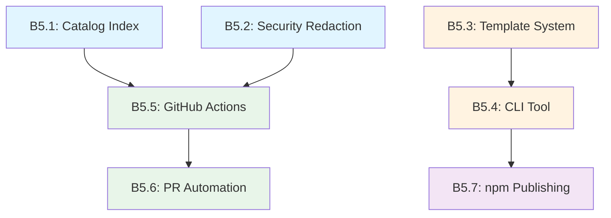

# Week 5 Build Missions: Production Readiness

## Mission Overview
Week 5 implements production infrastructure: catalog indexing, security redaction, GitHub Actions CI/CD, npm packaging, and template scaffolding. Missions are sized for single-session completion with clear dependencies.

---

# Build Mission B5.1: Catalog Index & Query Engine

## Mission Metadata
- **Session Type**: Build
- **Estimated Tokens**: 35k
- **Complexity**: High
- **Dependencies**: Week 1-4 protocol manifests
- **Enables**: B5.5 (GitHub Actions needs index), B5.6 (PR reporting)

## Token Budget Planning
```yaml
context_load:
  project_context: 3k
  existing_protocols: 4k
  research_findings: 3k
  
generation_budget:
  index_structure: 8k
  query_engine: 10k
  graph_traversal: 6k
  tests: 5k
  
validation_reserve: 5k
total_estimated: 39k
```

## Research Foundation
Applied findings from research missions:
- **R5.4**: Flat hash map with secondary indexes for O(1) URN lookups
- **R5.4**: Dependency graph with topological sort for build order
- **R5.4**: Index schema with governance rollups and PII tracking
- **R5.4**: Query performance targets (<1ms URN lookup, <10ms tag queries)

## Implementation Scope

### Core Deliverable
Implement `URNCatalogIndex` class from `missions/research/SPRINT_05_RESEARCH_R5.4.md` with:
- Primary hash map for URN → Artifact O(1) lookups
- Secondary indexes for namespace, tags, owner, PII
- Dependency graph with cycle detection
- Query methods (by URN, by tag, by governance criteria)
- Topological sort for build order
- Index persistence (save/load from JSON)

### File Structure
```
src/
├── catalog/
│   ├── index.ts           # URNCatalogIndex class
│   ├── query.ts           # Query helpers
│   ├── graph.ts           # Dependency graph utilities
│   └── schema.ts          # Index JSON schema
tests/
└── catalog/
    ├── index.test.ts
    ├── query.test.ts
    └── graph.test.ts
```

### Out of Scope (Future Missions)
- Sparse index chunking (>100k artifacts)
- HTTP-based catalog service
- CDN integration
- Database backend (PostgreSQL)

## Success Criteria
- [ ] URN lookup in <1ms (in-memory, 10k artifacts)
- [ ] Tag queries in <10ms (1000 results)
- [ ] Dependency graph traversal <50ms (1000 nodes)
- [ ] Cycle detection working correctly
- [ ] Index persists/loads without data loss
- [ ] 90%+ test coverage

## Implementation Checklist

### Essential (This Session)
- [ ] `URNCatalogIndex` class with all indexes
- [ ] `addArtifact()` updates all indexes atomically
- [ ] Query methods: `get()`, `findByTag()`, `findByGovernance()`
- [ ] Dependency graph: `getDependencyTree()`, `getBuildOrder()`
- [ ] Cycle detection with path tracking
- [ ] `save()` and `load()` methods
- [ ] Unit tests for all query paths
- [ ] Integration test with real manifests

### Deferred (Next Mission)
- [ ] Incremental updates (delta processing)
- [ ] Index compression (Brotli)
- [ ] Chunking for large catalogs
- [ ] CLI tool for index inspection

## Key Implementation Details

Reference complete implementation from `missions/research/SPRINT_05_RESEARCH_R5.4.md` section "URN catalog query engine".

### Index Schema
```typescript
interface CatalogIndex {
  version: string;
  format: 'urn-catalog-v1';
  lastModified: string;
  artifacts: Map<string, ArtifactManifest>;
  indexes: {
    byNamespace: Map<string, Set<string>>;
    byTag: Map<string, Set<string>>;
    byOwner: Map<string, Set<string>>;
    byPII: Set<string>;
  };
  dependencyGraph: {
    dependencies: Map<string, string[]>;
    dependents: Map<string, string[]>;
  };
}
```

### Performance Targets
- URN lookup: O(1) < 1ms
- Tag query: O(1) + O(m) < 10ms for 1000 results
- Dependency traversal: O(V + E) < 50ms for 1000 nodes
- Topological sort: O(V + E) using Kahn's algorithm

## Validation Protocol
```yaml
validate_with_sequential_thinking:
  focus: graph algorithm correctness
  check: cycle detection, topological sort
  tokens: ~5k

validate_with_tests:
  focus: query correctness
  check: all query methods return expected results
  coverage: 90%+
```

## Handoff Context
```json
{
  "completed": ["URNCatalogIndex", "query methods", "graph traversal"],
  "interfaces": [
    "URNCatalogIndex.get(urn)",
    "URNCatalogIndex.findByTag(tag)",
    "URNCatalogIndex.findByGovernance(criteria)",
    "URNCatalogIndex.getBuildOrder(rootUrn)"
  ],
  "assumptions": [
    "All URNs are valid format",
    "Artifacts immutable once added",
    "Index fits in memory (<10k artifacts)"
  ],
  "next_mission": "B5.5 - GitHub Actions needs index for manifest tracking",
  "blockers": []
}
```

---

# Build Mission B5.2: Security Redaction Utilities

## Mission Metadata
- **Session Type**: Build
- **Estimated Tokens**: 38k
- **Complexity**: High
- **Dependencies**: None (standalone utilities)
- **Enables**: B5.5 (CI needs redaction), B5.6 (PR reporting)

## Token Budget Planning
```yaml
context_load:
  project_context: 2k
  research_findings: 4k
  
generation_budget:
  secret_detection: 12k
  pii_redaction: 10k
  logging_safety: 6k
  tests: 6k
  
validation_reserve: 6k
total_estimated: 40k
```

## Research Foundation
Applied findings from research missions:
- **R5.3**: Gitleaks for primary secret detection (88% recall)
- **R5.3**: Credential pattern library (1600+ regex patterns)
- **R5.3**: Microsoft Presidio for PII (30+ types, F2 0.85-0.90)
- **R5.3**: Entropy-based detection (4.5 threshold for base64)
- **R5.3**: Pino logger with redaction paths

## Implementation Scope

### Core Deliverable
Two-stage security system:
1. **Pre-commit secret scanning** - Gitleaks integration + custom patterns
2. **Manifest redaction** - Field-based redaction for artifacts/logs

### File Structure
```
src/
├── security/
│   ├── secrets.ts         # Secret detection
│   ├── patterns.ts        # Credential regex patterns
│   ├── redactor.ts        # Manifest redaction
│   ├── entropy.ts         # Shannon entropy calculator
│   └── logger.ts          # Safe logger configuration
scripts/
└── detect-secrets.sh      # Pre-commit hook script
tests/
└── security/
    ├── secrets.test.ts
    ├── redactor.test.ts
    └── entropy.test.ts
```

### Out of Scope (Future Missions)
- Active credential verification (TruffleHog integration)
- Microsoft Presidio API integration
- Real-time monitoring
- Vault integration for tokenization

## Success Criteria
- [ ] Detects AWS keys, GitHub tokens, Stripe keys, SSH keys
- [ ] Entropy detection catches high-entropy secrets (>4.5)
- [ ] Connection string detection (PostgreSQL, MySQL, MongoDB)
- [ ] Field-based manifest redaction preserves structure
- [ ] Logger redacts authorization headers, passwords
- [ ] <5% false positive rate on test corpus
- [ ] Pre-commit hook blocks commits with secrets

## Implementation Checklist

### Essential (This Session)
- [ ] `SecretDetector` class with pattern matching
- [ ] Entropy calculator (Shannon entropy)
- [ ] High-risk field patterns from R5.3
- [ ] `ManifestRedactor` with JSONPath targeting
- [ ] Logger configuration with Pino redaction
- [ ] Pre-commit hook script
- [ ] Test corpus with known secrets/non-secrets
- [ ] Integration with existing CLI tools

### Deferred (Next Mission)
- [ ] Active verification (API calls)
- [ ] ML-based detection
- [ ] Custom pattern configuration
- [ ] Incremental scanning with cache

## Key Implementation Details

### Secret Detection Patterns
From `missions/research/SPRINT_05_RESEARCH_R5.3.md`:

```typescript
const CREDENTIAL_PATTERNS = {
  aws_access_key: /(?:A3T[A-Z0-9]|AKIA|AGPA|AIDA|AROA|AIPA|ANPA|ANVA|ASIA)[A-Z0-9]{16}/,
  aws_secret_key: /[A-Za-z0-9/+=]{40}/,
  github_token: /gh[pousr]_[a-zA-Z0-9]{36,}/,
  stripe_key: /sk_(live|test)_[0-9a-zA-Z]{24,99}/,
  ssh_private_key: /-----BEGIN ((EC|PGP|DSA|RSA|OPENSSH) )?PRIVATE KEY( BLOCK)?-----/,
  jwt: /eyJ[A-Za-z0-9-_]+\.eyJ[A-Za-z0-9-_]+\.[A-Za-z0-9-_.+/=]+/,
  connection_string: /(postgresql|mysql|mongodb(\+srv)?):\/\/([^:@\/]+)(:([^@\/]+))?@/,
};
```

### Manifest Redaction
```typescript
const HIGH_RISK_FIELDS = [
  /password/i, /secret/i, /token/i, /apikey/i, /api_key/i,
  /_key$/i, /private.*key/i, /credentials/i, /auth/i,
  /connection.*string/i, /database.*url/i
];

function redactManifest(manifest: any): any {
  // Preserve structure, redact sensitive fields
  // Use JSONPath for nested targeting
}
```

### Entropy Detection
Shannon entropy formula from R5.3:
```typescript
function calculateShannonEntropy(str: string): number {
  const freq = new Map<string, number>();
  for (const char of str) {
    freq.set(char, (freq.get(char) || 0) + 1);
  }
  
  let entropy = 0;
  for (const count of freq.values()) {
    const p = count / str.length;
    entropy -= p * Math.log2(p);
  }
  
  return entropy;
}
```

## Validation Protocol
```yaml
validate_with_test_corpus:
  real_secrets: 50 (from R5.3 benchmark)
  false_positives: <3 (6%)
  entropy_threshold: 4.5 for base64
  
validate_with_gitleaks:
  compare: our patterns vs Gitleaks results
  delta: document differences
```

## Handoff Context
```json
{
  "completed": ["secret detection", "manifest redaction", "safe logging"],
  "interfaces": [
    "SecretDetector.scan(content)",
    "ManifestRedactor.redact(manifest)",
    "createSafeLogger(config)"
  ],
  "assumptions": [
    "Gitleaks installed for pre-commit",
    "Pino logger used project-wide",
    "Manifests are JSON/YAML"
  ],
  "next_mission": "B5.5 - CI needs redaction before PR creation",
  "blockers": []
}
```

---

# Build Mission B5.3: Template System & Generators

## Mission Metadata
- **Session Type**: Build
- **Estimated Tokens**: 32k
- **Complexity**: Medium
- **Dependencies**: Existing protocol structures
- **Enables**: B5.4 (create-protocol-demo needs templates)

## Token Budget Planning
```yaml
context_load:
  project_context: 2k
  research_findings: 3k
  
generation_budget:
  handlebars_setup: 6k
  templates: 10k
  helpers: 5k
  tests: 4k
  
validation_reserve: 4k
total_estimated: 30k
```

## Research Foundation
Applied findings from research missions:
- **R5.4**: Handlebars for logic-less templates (proven at scale)
- **R5.4**: Helper functions for URN manipulation
- **R5.4**: Template directory structure (partials, per-protocol)
- **R5.4**: Multi-layer validation (syntax, variables, output)

## Implementation Scope

### Core Deliverable
Handlebars-based template system for generating protocol manifests:
- Event Protocol templates (JS/TS variants)
- Data Protocol templates (JS/TS variants)
- API Protocol templates (JS/TS variants)
- Shared partials (governance, metadata, dependencies)
- Helper functions (case transformations, URN building)

### File Structure
```
templates/
├── event-protocol/
│   ├── manifest.json.hbs
│   ├── schema.json.hbs
│   └── README.md.hbs
├── data-protocol/
│   ├── manifest.json.hbs
│   ├── schema.json.hbs
│   └── README.md.hbs
├── api-protocol/
│   ├── manifest.json.hbs
│   ├── openapi.yaml.hbs
│   └── README.md.hbs
└── partials/
    ├── governance.json.hbs
    ├── dependencies.json.hbs
    └── metadata.json.hbs
src/
├── templates/
│   ├── generator.ts       # ManifestGenerator class
│   ├── helpers.ts         # Handlebars helpers
│   └── validator.ts       # Template validation
```

### Out of Scope (Future Missions)
- UI-based template editor
- Template marketplace/registry
- Custom template language
- Template versioning system

## Success Criteria
- [ ] All protocol types have JS/TS templates
- [ ] Templates generate valid manifests (pass JSON Schema)
- [ ] Helpers handle all case transformations
- [ ] URN generation works correctly
- [ ] Partials reused across templates
- [ ] Template syntax validation pre-packaging
- [ ] Generated manifests pass protocol validators

## Implementation Checklist

### Essential (This Session)
- [ ] Handlebars setup with helper registration
- [ ] Templates for 3 protocol types × 2 languages
- [ ] Helper functions: dasherize, camelCase, pascalCase, kebabCase, buildUrn
- [ ] Partials for governance, metadata, dependencies
- [ ] `ManifestGenerator` class
- [ ] Template syntax validator
- [ ] Output validation (JSON Schema)
- [ ] Tests for each template type

### Deferred (Next Mission)
- [ ] Interactive template builder
- [ ] Template preview UI
- [ ] Custom helper registration API
- [ ] Template inheritance system

## Key Implementation Details

### Handlebars Helpers
From `missions/research/SPRINT_05_RESEARCH_R5.4.md`:

```typescript
import Handlebars from 'handlebars';

export function registerHelpers(hbs: typeof Handlebars) {
  hbs.registerHelper('dasherize', (str: string) => 
    str.replace(/([A-Z])/g, '-$1').replace(/^-/, '').toLowerCase()
  );
  
  hbs.registerHelper('camelCase', (str: string) =>
    str.replace(/[-_]([a-z])/g, (_, c) => c.toUpperCase())
  );
  
  hbs.registerHelper('pascalCase', (str: string) => {
    const camel = str.replace(/[-_]([a-z])/g, (_, c) => c.toUpperCase());
    return camel.charAt(0).toUpperCase() + camel.slice(1);
  });
  
  hbs.registerHelper('buildUrn', (type, namespace, name, version) =>
    `urn:protocol:${type}:${namespace}.${name}:${version}`
  );
  
  hbs.registerHelper('default', (value, defaultValue) =>
    value != null ? value : defaultValue
  );
}
```

### Template Example
```handlebars
{{!-- templates/event-protocol/manifest.json.hbs --}}
{
  "$schema": "https://schemas.example.com/event-protocol/v1",
  "urn": "{{buildUrn 'event' namespace eventName version}}",
  "name": "{{eventName}}",
  "namespace": "{{namespace}}",
  "metadata": {
    "title": "{{pascalCase eventName}} Event",
    "description": "{{description}}",
    "owner": "{{owner}}",
    {{#if containsPII}}
    {{> governance pii=true classification=classification}}
    {{/if}}
    "tags": [{{#each tags}}"{{this}}"{{#unless @last}},{{/unless}}{{/each}}]
  }
}
```

### Validation Pipeline
```typescript
class TemplateValidator {
  async validateSyntax(templatePath: string): Promise<boolean>
  validateVariables(template: string, expectedVars: string[]): boolean
  detectCircularPartials(templatesDir: string): void
  validateOutput(generated: string, schema: object): boolean
}
```

## Validation Protocol
```yaml
validate_with_tests:
  each_protocol_type: generate + validate against schema
  all_helpers: unit tests for case transformations
  urns: verify correct format
  
validate_generated_manifests:
  pass_to: existing protocol validators
  ensure: no regression in validation
```

## Handoff Context
```json
{
  "completed": ["templates", "helpers", "generator", "validation"],
  "interfaces": [
    "ManifestGenerator.generate(type, data)",
    "registerHelpers(handlebars)",
    "TemplateValidator.validate(template)"
  ],
  "assumptions": [
    "Handlebars v4.7.7+ (CVE patches)",
    "Templates output JSON",
    "Partials registered globally"
  ],
  "next_mission": "B5.4 - CLI scaffolding uses these templates",
  "blockers": []
}
```

---

# Build Mission B5.4: CLI Scaffolding Tool (create-protocol-demo)

## Mission Metadata
- **Session Type**: Build
- **Estimated Tokens**: 36k
- **Complexity**: Medium-High
- **Dependencies**: B5.3 (templates must exist)
- **Enables**: B5.7 (npm packaging)

## Token Budget Planning
```yaml
context_load:
  project_context: 2k
  research_findings: 4k
  template_context: 2k
  
generation_budget:
  cli_core: 8k
  prompts_flow: 6k
  file_operations: 6k
  package_json_gen: 4k
  tests: 6k
  
validation_reserve: 5k
total_estimated: 37k
```

## Research Foundation
Applied findings from research missions:
- **R5.2**: Create-vite architecture (bundled CLI + external templates)
- **R5.2**: Prompts library for interactive flows (~700KB lighter than Inquirer)
- **R5.2**: Cross-platform bin field, shebang, npm wrappers
- **R5.2**: Esbuild for bundling (50ms builds)
- **R5.2**: Optimize for npx usage with @latest

## Implementation Scope

### Core Deliverable
Interactive CLI tool `create-protocol-demo` that scaffolds new protocol projects:
- Interactive prompts (project name, protocol type, language, package manager)
- Template copying from B5.3
- package.json generation
- Git initialization
- Next steps display

### File Structure
```
packages/create-protocol-demo/
├── src/
│   ├── cli.ts             # Main CLI entry (with shebang)
│   ├── index.ts           # Library entry
│   ├── prompts.ts         # Interactive prompts
│   ├── scaffold.ts        # File operations
│   └── utils.ts           # Validation, helpers
├── bin/
│   └── create-protocol-demo.js  # Executable wrapper
├── templates/             # From B5.3
├── package.json
├── tsconfig.json
└── build.js               # Esbuild configuration
```

### Out of Scope (Future Missions)
- GitHub template repository support
- Example implementations fetching
- Plugin system
- Interactive template customization

## Success Criteria
- [ ] Interactive prompts work smoothly
- [ ] Generates valid project structure
- [ ] package.json correct for all variants
- [ ] Git initialization optional and working
- [ ] Cross-platform (Windows/Mac/Linux)
- [ ] Bundle size <500KB
- [ ] First run <30 seconds (including npm install)
- [ ] Works via `npx create-protocol-demo@latest`

## Implementation Checklist

### Essential (This Session)
- [ ] CLI entry point with shebang
- [ ] Prompts flow (name, type, language, pkg manager, git)
- [ ] Project name validation
- [ ] Template copying logic
- [ ] package.json merging
- [ ] Git initialization (optional)
- [ ] Success message with next steps
- [ ] Error handling and cleanup
- [ ] Esbuild configuration
- [ ] Integration test (end-to-end)

### Deferred (Next Mission)
- [ ] Update notifier
- [ ] Offline mode
- [ ] Template caching
- [ ] Progress animations

## Key Implementation Details

### Prompts Flow
From `missions/research/SPRINT_05_RESEARCH_R5.2.md`:

```typescript
import prompts from 'prompts';
import validatePackageName from 'validate-npm-package-name';

async function runPrompts() {
  const result = await prompts([
    {
      type: 'text',
      name: 'projectName',
      message: 'Project name:',
      initial: 'my-protocol-project',
      validate: (name) => {
        const validation = validatePackageName(name);
        return validation.validForNewPackages || 
          `Invalid name: ${validation.errors?.[0]}`;
      }
    },
    {
      type: 'select',
      name: 'protocolType',
      message: 'Select protocol type:',
      choices: [
        { title: 'Event Protocol', value: 'event', description: 'For event-driven systems' },
        { title: 'Data Protocol', value: 'data', description: 'For data contracts' },
        { title: 'API Protocol', value: 'api', description: 'For REST/GraphQL APIs' }
      ]
    },
    {
      type: 'select',
      name: 'language',
      message: 'TypeScript or JavaScript?',
      choices: [
        { title: 'TypeScript', value: 'typescript' },
        { title: 'JavaScript', value: 'javascript' }
      ]
    },
    {
      type: 'confirm',
      name: 'initGit',
      message: 'Initialize git repository?',
      initial: true
    }
  ]);
  
  return result;
}
```

### Scaffolding Logic
```typescript
async function scaffold(projectName: string, options: ScaffoldOptions) {
  const targetDir = path.resolve(process.cwd(), projectName);
  
  // 1. Check directory doesn't exist
  if (fs.existsSync(targetDir)) {
    throw new Error(`Directory ${projectName} already exists`);
  }
  
  // 2. Create directory
  await fs.mkdir(targetDir, { recursive: true });
  
  try {
    // 3. Copy template
    const templateDir = path.join(__dirname, '../templates', 
      `${options.protocolType}-protocol`);
    await copyTemplate(templateDir, targetDir);
    
    // 4. Generate package.json
    await generatePackageJson(targetDir, projectName, options);
    
    // 5. Initialize git (optional)
    if (options.initGit) {
      await initGit(targetDir);
    }
    
    // 6. Display success
    displaySuccess(projectName, options);
    
  } catch (error) {
    // Cleanup on failure
    await fs.rm(targetDir, { recursive: true, force: true });
    throw error;
  }
}
```

### Esbuild Configuration
```javascript
// build.js
const esbuild = require('esbuild');

esbuild.build({
  entryPoints: ['src/cli.ts'],
  bundle: true,
  platform: 'node',
  target: 'node14',
  outfile: 'dist/cli.bundle.js',
  minify: true,
  external: ['fsevents'],
  treeShaking: true,
  banner: {
    js: '#!/usr/bin/env node'
  }
}).catch(() => process.exit(1));
```

### Cross-Platform Compatibility
```typescript
// Shebang in src/cli.ts
#!/usr/bin/env node

// Path handling
import path from 'path';
const targetDir = path.join(process.cwd(), projectName); // ✅

// Not this:
const targetDir = process.cwd() + '/' + projectName;     // ❌
```

## Validation Protocol
```yaml
validate_cross_platform:
  test_on: [ubuntu-latest, windows-latest, macos-latest]
  package_managers: [npm, yarn, pnpm]
  
validate_with_npm_pack:
  dry_run: check published contents
  actual_install: npx ./create-protocol-demo-*.tgz test
  
validate_generated_project:
  npm_install: should succeed
  protocol_validate: generated manifests valid
```

## Handoff Context
```json
{
  "completed": ["CLI tool", "interactive prompts", "scaffolding", "bundling"],
  "interfaces": [
    "npx create-protocol-demo",
    "npx create-protocol-demo my-project --skip-git"
  ],
  "assumptions": [
    "Templates from B5.3 available",
    "Node 14+ available",
    "npm/yarn/pnpm for package manager"
  ],
  "next_mission": "B5.7 - npm publishing configuration",
  "blockers": ["Requires B5.3 templates completed"]
}
```

---

# Build Mission B5.5: GitHub Actions Workflow (Discovery & Validation)

## Mission Metadata
- **Session Type**: Build
- **Estimated Tokens**: 34k
- **Complexity**: High
- **Dependencies**: B5.1 (catalog index), B5.2 (redaction)
- **Enables**: B5.6 (PR automation)

## Token Budget Planning
```yaml
context_load:
  project_context: 3k
  research_findings: 4k
  existing_cli: 2k
  
generation_budget:
  workflow_yaml: 10k
  caching_strategy: 6k
  artifact_handling: 5k
  summary_generation: 4k
  
validation_reserve: 5k
total_estimated: 34k
```

## Research Foundation
Applied findings from research missions:
- **R5.1**: actions/setup-node@v4 with built-in caching
- **R5.1**: tsx for TypeScript execution (no compilation)
- **R5.1**: actions/cache@v4 (mandatory Feb 2025)
- **R5.1**: actions/upload-artifact@v4 (v3 deprecated Jan 2025)
- **R5.1**: Workflow summaries via $GITHUB_STEP_SUMMARY

## Implementation Scope

### Core Deliverable
Complete GitHub Actions workflow for nightly protocol discovery:
- Scheduled nightly runs (2 AM UTC)
- Manual trigger with cache bypass
- Discovery → Validation → Report generation
- Artifact publishing
- Workflow summaries
- Prepare for PR creation (B5.6)

### File Structure
```
.github/
├── workflows/
│   ├── nightly-discovery.yml    # Main workflow
│   └── test-platforms.yml       # Cross-platform testing
└── actions/
    └── setup-protocol-tools/    # Composite action (optional)
```

### Out of Scope (Future Missions)
- PR creation (handled in B5.6)
- Slack/Discord notifications
- Performance tracking dashboard
- Matrix strategy for multiple environments

## Success Criteria
- [ ] Workflow runs nightly at 2 AM UTC
- [ ] Manual dispatch works with inputs
- [ ] Caching reduces runtime by 80%
- [ ] Discovery results uploaded as artifacts
- [ ] Workflow summary shows key metrics
- [ ] Redaction applied before artifact upload
- [ ] Secrets never logged
- [ ] Timeout prevents runaway workflows

## Implementation Checklist

### Essential (This Session)
- [ ] Main workflow YAML with schedule + dispatch
- [ ] Node.js setup with caching
- [ ] Discovery CLI invocation
- [ ] Validation CLI invocation
- [ ] Report generation CLI invocation
- [ ] Artifact upload with retention
- [ ] Workflow summary generation
- [ ] Redaction integration
- [ ] Concurrency control
- [ ] Timeout configuration

### Deferred (Next Mission)
- [ ] PR creation (B5.6)
- [ ] Notification integrations
- [ ] Advanced caching strategies
- [ ] Multi-environment support

## Key Implementation Details

### Main Workflow Structure
From `missions/research/SPRINT_05_RESEARCH_R5.1.md`:

```yaml
name: Nightly Protocol Discovery

on:
  schedule:
    - cron: '0 2 * * *'  # 2 AM UTC daily
  workflow_dispatch:
    inputs:
      skip_cache:
        description: 'Skip discovery cache'
        type: boolean
        default: false
      environment:
        description: 'Target environment'
        type: choice
        options: [staging, production]
        default: staging

permissions:
  contents: write
  pull-requests: write

concurrency:
  group: protocol-discovery-${{ inputs.environment || 'staging' }}
  cancel-in-progress: false

jobs:
  discover-validate:
    runs-on: ubuntu-latest
    timeout-minutes: 30
    outputs:
      changes-detected: ${{ steps.check-changes.outputs.changed }}
      
    steps:
      - uses: actions/checkout@v4
      
      - name: Setup Node.js
        uses: actions/setup-node@v4
        with:
          node-version-file: '.nvmrc'
          cache: 'npm'
      
      - name: Install dependencies
        timeout-minutes: 5
        run: npm ci
      
      - name: Type check
        run: npx tsc --noEmit
      
      - name: Get current date
        id: date
        run: echo "today=$(date +'%Y-%m-%d')" >> $GITHUB_OUTPUT
      
      - name: Restore discovery cache
        if: ${{ !inputs.skip_cache }}
        uses: actions/cache@v4
        with:
          path: .cache/discovery
          key: discovery-${{ hashFiles('src/cli/**/*.ts') }}-${{ steps.date.outputs.today }}
          restore-keys: |
            discovery-${{ hashFiles('src/cli/**/*.ts') }}-
            discovery-
      
      - name: Discover protocol changes
        id: discover
        env:
          DATABASE_URL: ${{ secrets.PROTOCOL_DB_URL }}
          API_KEY: ${{ secrets.EXTERNAL_API_KEY }}
        run: |
          npx tsx src/cli/discover.ts \
            --cache-dir .cache/discovery \
            --output discovered.json
          
          COUNT=$(jq '.protocols | length' discovered.json)
          echo "count=$COUNT" >> $GITHUB_OUTPUT
      
      - name: Apply redaction
        run: |
          npx tsx src/cli/redact.ts \
            --input discovered.json \
            --output discovered-redacted.json
      
      - name: Validate manifests
        id: validate
        run: |
          npx tsx src/cli/validate.ts \
            --input discovered-redacted.json \
            --output validation-results.json
          
          STATUS=$(jq -r '.status' validation-results.json)
          ERRORS=$(jq -r '.errors | length' validation-results.json)
          echo "status=$STATUS" >> $GITHUB_OUTPUT
          echo "errors=$ERRORS" >> $GITHUB_OUTPUT
      
      - name: Generate governance report
        run: |
          npx tsx src/cli/report.ts \
            --discovered discovered-redacted.json \
            --validation validation-results.json \
            --format markdown \
            --output governance-report.md
      
      - name: Check for changes
        id: check-changes
        run: |
          if [ -n "$(git status --porcelain)" ]; then
            echo "changed=true" >> $GITHUB_OUTPUT
          else
            echo "changed=false" >> $GITHUB_OUTPUT
          fi
      
      - name: Upload results
        if: always()
        uses: actions/upload-artifact@v4
        with:
          name: protocol-discovery-${{ github.run_number }}
          path: |
            discovered-redacted.json
            validation-results.json
            governance-report.md
          retention-days: 14
      
      - name: Generate workflow summary
        if: always()
        run: |
          {
            echo "# Protocol Discovery Summary"
            echo ""
            echo "## Scan Results"
            echo ""
            echo "| Metric | Value |"
            echo "|--------|-------|"
            echo "| Date | ${{ steps.date.outputs.today }} |"
            echo "| Protocols scanned | ${{ steps.discover.outputs.count }} |"
            echo "| Validation status | ${{ steps.validate.outputs.status }} |"
            echo "| Errors detected | ${{ steps.validate.outputs.errors }} |"
            echo "| Changes found | ${{ steps.check-changes.outputs.changed }} |"
            echo ""
            
            if [ "${{ steps.validate.outputs.status }}" == "success" ]; then
              echo "✅ **All protocol manifests validated successfully**"
            else
              echo "⚠️ **Validation issues detected - review required**"
            fi
          } >> $GITHUB_STEP_SUMMARY
```

### Caching Strategy
- **Dependencies**: Handled by setup-node (package-lock.json hash)
- **Discovery results**: Date-based key with code hash fallback
- **TypeScript**: tsc --noEmit doesn't need caching

### Security Considerations
```yaml
# Never log secrets
- name: Discover (safe logging)
  env:
    DATABASE_URL: ${{ secrets.PROTOCOL_DB_URL }}
  run: |
    # Secrets never in commands
    npx tsx src/cli/discover.ts

# Apply redaction before artifacts
- name: Apply redaction
  run: npx tsx src/cli/redact.ts --input discovered.json
```

## Validation Protocol
```yaml
validate_workflow_syntax:
  tool: actionlint
  check: YAML syntax, job dependencies
  
validate_locally:
  tool: act (nektos/act)
  test: workflow runs in local Docker
  
validate_with_test_repo:
  create: test repository
  trigger: manual dispatch
  verify: artifacts created, summary displayed
```

## Handoff Context
```json
{
  "completed": ["nightly workflow", "caching", "artifacts", "summaries"],
  "interfaces": [
    "Workflow outputs: changes-detected",
    "Artifacts: protocol-discovery-{run_number}",
    "Secrets: DATABASE_URL, API_KEY"
  ],
  "assumptions": [
    "CLI tools in src/cli/",
    "Redaction applied before upload",
    "Secrets configured in repo settings"
  ],
  "next_mission": "B5.6 - PR creation consumes workflow outputs",
  "blockers": ["Requires B5.1 index, B5.2 redaction"]
}
```

---

# Build Mission B5.6: PR Automation & Governance Reporting

## Mission Metadata
- **Session Type**: Build
- **Estimated Tokens**: 30k
- **Complexity**: Medium
- **Dependencies**: B5.5 (workflow must detect changes)
- **Enables**: Week 6 launch

## Token Budget Planning
```yaml
context_load:
  project_context: 2k
  research_findings: 3k
  workflow_context: 2k
  
generation_budget:
  pr_workflow: 8k
  pr_body_template: 5k
  apply_changes: 6k
  tests: 4k
  
validation_reserve: 4k
total_estimated: 30k
```

## Research Foundation
Applied findings from research missions:
- **R5.1**: peter-evans/create-pull-request@v7 (battle-tested)
- **R5.1**: PR updates vs creation (fixed branch name)
- **R5.1**: Rich PR body formatting (collapsible sections, tables)
- **R5.1**: Permissions: contents:write, pull-requests:write

## Implementation Scope

### Core Deliverable
Automated PR creation workflow:
- Conditional job (only if changes detected)
- Apply discovered changes to repository
- Create/update PR with governance report
- Add labels, reviewers
- Link to artifacts

### File Structure
```
.github/
└── workflows/
    └── create-pr.yml           # PR automation job
src/
└── cli/
    └── apply-changes.ts        # Apply discovered changes
```

### Out of Scope (Future Missions)
- Auto-merge for minor changes
- Comment updates on existing PRs
- External notification systems
- Custom PR templates per protocol type

## Success Criteria
- [ ] PR created only when changes detected
- [ ] PR body includes governance report
- [ ] PR updates existing if branch exists
- [ ] Labels applied automatically
- [ ] Reviewers assigned
- [ ] Artifacts linked in PR body
- [ ] Branch cleaned up after merge

## Implementation Checklist

### Essential (This Session)
- [ ] PR creation workflow job
- [ ] Conditional execution (`needs` + `if`)
- [ ] `apply-changes.ts` CLI tool
- [ ] PR body template
- [ ] peter-evans/create-pull-request integration
- [ ] Labels and reviewers configuration
- [ ] Branch naming strategy
- [ ] Tests for apply-changes logic

### Deferred (Next Mission)
- [ ] Auto-merge capabilities
- [ ] PR comment updates
- [ ] Multiple PR strategies
- [ ] Custom PR templates

## Key Implementation Details

### PR Creation Job
From `missions/research/SPRINT_05_RESEARCH_R5.1.md`:

```yaml
create-pr:
  needs: discover-validate
  if: needs.discover-validate.outputs.changes-detected == 'true'
  runs-on: ubuntu-latest
  timeout-minutes: 10
  
  steps:
    - uses: actions/checkout@v4
    
    - name: Download discovery results
      uses: actions/download-artifact@v4
      with:
        name: protocol-discovery-${{ github.run_number }}
    
    - name: Setup Node.js
      uses: actions/setup-node@v4
      with:
        node-version-file: '.nvmrc'
        cache: 'npm'
    
    - name: Install dependencies
      run: npm ci
    
    - name: Apply changes to repository
      run: |
        npx tsx src/cli/apply-changes.ts \
          --input discovered-redacted.json \
          --manifest-dir manifests/
    
    - name: Create Pull Request
      id: pr
      uses: peter-evans/create-pull-request@v7
      with:
        token: ${{ secrets.GITHUB_TOKEN }}
        commit-message: |
          chore: update protocol manifests
          
          Automated protocol discovery detected changes.
          See governance report for details.
        committer: github-actions[bot] <41898282+github-actions[bot]@users.noreply.github.com>
        branch: automated/protocol-updates
        delete-branch: true
        title: '[Automated] Protocol Manifest Updates - ${{ github.run_number }}'
        body-path: governance-report.md
        labels: |
          automated
          protocol-updates
          needs-review
        reviewers: protocol-team-lead
        team-reviewers: protocol-governance
    
    - name: PR summary
      if: steps.pr.outputs.pull-request-operation == 'created'
      run: |
        echo "✅ Created PR #${{ steps.pr.outputs.pull-request-number }}"
        echo "🔗 PR URL: ${{ steps.pr.outputs.pull-request-url }}"
```

### PR Body Template Enhancement
```markdown
## Protocol Discovery Results

Automated nightly scan discovered changes to protocol manifests.

### Summary
- **Protocols scanned:** ${{ steps.discover.outputs.count }}
- **Changes detected:** ${{ steps.discover.outputs.changes }}
- **Validation status:** ${{ steps.validate.outputs.status }}

### Governance Report

<details>
<summary>Click to expand full report</summary>

$(cat governance-report.md)

</details>

### Files Modified
```
$(git diff --stat)
```

### Review Checklist
- [ ] PII classification correct
- [ ] Breaking changes documented
- [ ] Delivery contracts validated
- [ ] Ownership assigned

---

**Generated:** $(date -u +"%Y-%m-%d %H:%M:%S UTC")  
**Workflow run:** ${{ github.server_url }}/${{ github.repository }}/actions/runs/${{ github.run_id }}  
**Artifacts:** [Download](${{ steps.upload.outputs.artifact-url }})
```

### Apply Changes Logic
```typescript
// src/cli/apply-changes.ts
export async function applyChanges(
  discoveredPath: string,
  manifestDir: string
) {
  const discovered = JSON.parse(await fs.readFile(discoveredPath, 'utf-8'));
  
  for (const protocol of discovered.protocols) {
    const urn = protocol.urn;
    const [_, kind, namespace, name, version] = parseUrn(urn);
    
    // Determine file path based on URN
    const filePath = path.join(
      manifestDir,
      kind,
      namespace,
      `${name}-${version}.json`
    );
    
    // Ensure directory exists
    await fs.mkdir(path.dirname(filePath), { recursive: true });
    
    // Write manifest
    await fs.writeFile(
      filePath,
      JSON.stringify(protocol, null, 2),
      'utf-8'
    );
    
    console.log(`✅ Updated: ${filePath}`);
  }
  
  // Update catalog index
  await updateCatalogIndex(manifestDir, discovered.protocols);
}
```

## Validation Protocol
```yaml
validate_pr_creation:
  manual_trigger: force changes in test
  verify: PR created with correct body
  check: labels, reviewers applied
  
validate_pr_update:
  trigger: second workflow run
  verify: existing PR updated, not new created
  
validate_branch_cleanup:
  merge: test PR
  verify: branch auto-deleted
```

## Handoff Context
```json
{
  "completed": ["PR automation", "apply-changes", "governance reporting"],
  "interfaces": [
    "PR body includes governance report",
    "PRs auto-update on fixed branch",
    "Reviewers assigned automatically"
  ],
  "assumptions": [
    "Workflow permissions configured",
    "Team reviewers exist",
    "Manifest directory structure stable"
  ],
  "next_mission": "B5.7 - npm packaging for distribution",
  "blockers": ["Requires B5.5 workflow outputs"]
}
```

---

# Build Mission B5.7: npm Package Configuration & Distribution

## Mission Metadata
- **Session Type**: Build
- **Estimated Tokens**: 28k
- **Complexity**: Medium
- **Dependencies**: B5.4 (create-protocol-demo tool)
- **Enables**: Week 6 launch, public distribution

## Token Budget Planning
```yaml
context_load:
  project_context: 2k
  research_findings: 3k
  cli_context: 2k
  
generation_budget:
  package_json: 6k
  publishing_workflow: 8k
  cross_platform_tests: 5k
  documentation: 4k
  
validation_reserve: 3k
total_estimated: 29k
```

## Research Foundation
Applied findings from research missions:
- **R5.2**: Scoped packages require `--access public`
- **R5.2**: bin field, shebang, cross-platform wrappers
- **R5.2**: Provenance with `--provenance` flag
- **R5.2**: files whitelist over .npmignore
- **R5.2**: prepublishOnly for build automation

## Implementation Scope

### Core Deliverable
Complete npm publishing setup:
- package.json configuration (bin, files, exports)
- Publishing workflow (GitHub Actions)
- Cross-platform testing matrix
- npm provenance
- README and documentation

### File Structure
```
packages/create-protocol-demo/
├── package.json           # Configured for publishing
├── .npmignore            # Exclude dev files
├── README.md             # Installation, usage
├── LICENSE               # Apache 2.0
└── CHANGELOG.md          # Version history
.github/
└── workflows/
    ├── publish.yml        # npm publishing
    └── test-cli.yml       # Cross-platform tests
```

### Out of Scope (Future Missions)
- Automated changelog generation
- Version bump automation (changesets)
- Package analytics integration
- Beta/canary release channels

## Success Criteria
- [ ] Package published to npm successfully
- [ ] `npx create-protocol-demo@latest` works
- [ ] Cross-platform tests pass (Win/Mac/Linux)
- [ ] Provenance badge on npm
- [ ] README clear and comprehensive
- [ ] Bundle size <500KB
- [ ] Package installs without errors

## Implementation Checklist

### Essential (This Session)
- [ ] package.json fully configured
- [ ] bin field points to bundled CLI
- [ ] files whitelist (dist, bin, templates, README)
- [ ] publishConfig access public
- [ ] Publishing workflow
- [ ] Cross-platform test matrix
- [ ] prepublishOnly build script
- [ ] README with quickstart
- [ ] LICENSE file

### Deferred (Next Mission)
- [ ] Changelog automation
- [ ] Version management strategy
- [ ] npm package page optimization
- [ ] Download badges

## Key Implementation Details

### package.json Configuration
From `missions/research/SPRINT_05_RESEARCH_R5.2.md`:

```json
{
  "name": "@yourorg/create-protocol-demo",
  "version": "1.0.0",
  "description": "Scaffolding tool for protocol manifest projects",
  "type": "module",
  "bin": {
    "create-protocol-demo": "./bin/create-protocol-demo.js"
  },
  "main": "./dist/index.cjs",
  "module": "./dist/index.mjs",
  "types": "./dist/index.d.ts",
  "exports": {
    ".": {
      "import": "./dist/index.mjs",
      "require": "./dist/index.cjs",
      "types": "./dist/index.d.ts"
    },
    "./package.json": "./package.json"
  },
  "files": [
    "bin/",
    "dist/",
    "templates/",
    "README.md",
    "LICENSE"
  ],
  "scripts": {
    "build": "node build.js",
    "test": "vitest",
    "test:ci": "vitest run",
    "prepublishOnly": "npm run build && npm run test:ci",
    "pack:test": "npm pack && tar -tzf *.tgz"
  },
  "engines": {
    "node": ">=16.0.0"
  },
  "publishConfig": {
    "access": "public"
  },
  "keywords": [
    "protocol",
    "manifest",
    "scaffolding",
    "cli",
    "generator",
    "create"
  ],
  "repository": {
    "type": "git",
    "url": "https://github.com/yourorg/protocol-tools"
  },
  "license": "Apache-2.0",
  "dependencies": {
    "prompts": "^2.4.2",
    "chalk": "^5.3.0",
    "ora": "^8.0.1",
    "fs-extra": "^11.2.0",
    "validate-npm-package-name": "^5.0.0"
  }
}
```

### Publishing Workflow
```yaml
name: Publish to npm

on:
  release:
    types: [created]
  workflow_dispatch:
    inputs:
      version:
        description: 'Version to publish'
        required: true

permissions:
  contents: read
  id-token: write

jobs:
  test:
    strategy:
      matrix:
        os: [ubuntu-latest, windows-latest, macos-latest]
        node: [16, 18, 20]
    runs-on: ${{ matrix.os }}
    steps:
      - uses: actions/checkout@v4
      - uses: actions/setup-node@v4
        with:
          node-version: ${{ matrix.node }}
          cache: 'npm'
      - run: npm ci
      - run: npm test
      - run: npm run build
      - name: Test CLI installation
        run: |
          npm pack
          npm install -g ./create-protocol-demo-*.tgz
          create-protocol-demo test-project --help
  
  publish:
    needs: test
    runs-on: ubuntu-latest
    steps:
      - uses: actions/checkout@v4
      
      - uses: actions/setup-node@v4
        with:
          node-version: '20'
          registry-url: 'https://registry.npmjs.org'
          cache: 'npm'
      
      - run: npm ci
      - run: npm run build
      
      - name: Publish to npm
        env:
          NODE_AUTH_TOKEN: ${{ secrets.NPM_TOKEN }}
        run: npm publish --provenance --access public
      
      - name: Verify package
        run: |
          sleep 30  # Wait for npm registry propagation
          npx create-protocol-demo@latest --version
```

### Cross-Platform Testing
```yaml
name: Test CLI Cross-Platform

on: [push, pull_request]

jobs:
  test-platforms:
    strategy:
      fail-fast: false
      matrix:
        os: [ubuntu-latest, windows-latest, macos-latest]
        node: [16, 18, 20]
        package-manager: [npm, yarn, pnpm]
    runs-on: ${{ matrix.os }}
    steps:
      - uses: actions/checkout@v4
      
      - uses: actions/setup-node@v4
        with:
          node-version: ${{ matrix.node }}
      
      - name: Install package manager
        run: |
          npm install -g ${{ matrix.package-manager }}
      
      - run: npm ci
      - run: npm run build
      - run: npm pack
      
      - name: Test installation
        shell: bash
        run: |
          ${{ matrix.package-manager }} install -g ./create-protocol-demo-*.tgz
          create-protocol-demo --version
          create-protocol-demo test-project --skip-install
          
      - name: Verify generated project
        working-directory: test-project
        run: |
          cat package.json
          test -f package.json
          test -f README.md
```

### README Template
```markdown
# create-protocol-demo

Scaffolding tool for protocol manifest projects.

## Quick Start

```bash
npx create-protocol-demo@latest my-project
cd my-project
npm install
npm run dev
```

## Features

- 🚀 Fast scaffolding with interactive prompts
- 📦 TypeScript and JavaScript support
- 🎯 Protocol types: Event, Data, API
- 🔧 Pre-configured validation and testing
- 📝 Example implementations included

## Usage

### Interactive Mode
```bash
npx create-protocol-demo@latest
```

### With Options
```bash
npx create-protocol-demo@latest my-project --typescript --protocol event
```

## Options

- `--help` - Show help
- `--version` - Show version
- `--skip-git` - Skip git initialization
- `--skip-install` - Skip dependency installation

## Requirements

- Node.js 16+
- npm, yarn, or pnpm

## License

Apache-2.0
```

## Validation Protocol
```yaml
validate_local_publish:
  steps:
    - npm pack
    - npm install -g ./create-protocol-demo-*.tgz
    - create-protocol-demo test --skip-install
    - verify: package.json, manifests exist
    
validate_npm_registry:
  after_publish:
    - wait: 2 minutes (propagation)
    - npx create-protocol-demo@latest --version
    - verify: latest version shown
    
validate_provenance:
  check: npm package page
  verify: green provenance badge
```

## Handoff Context
```json
{
  "completed": ["package config", "publishing workflow", "cross-platform tests"],
  "interfaces": [
    "npx create-protocol-demo@latest",
    "npm package: @yourorg/create-protocol-demo"
  ],
  "assumptions": [
    "NPM_TOKEN secret configured",
    "Package name available",
    "Tests pass on all platforms"
  ],
  "next_mission": "Week 6 - Launch and documentation",
  "blockers": ["Requires B5.4 CLI tool completed"]
}
```

---

## Week 5 Mission Dependencies



**Execution Strategy:**
- **Phase 1 (Parallel)**: B5.1, B5.2, B5.3 can run concurrently
- **Phase 2**: B5.4 depends on B5.3
- **Phase 3 (Parallel)**: B5.5 depends on B5.1 + B5.2
- **Phase 4**: B5.6 depends on B5.5, B5.7 depends on B5.4

**Total Estimated Tokens**: ~238k across 7 missions
**Estimated Time**: 7-10 sessions (1 per mission)